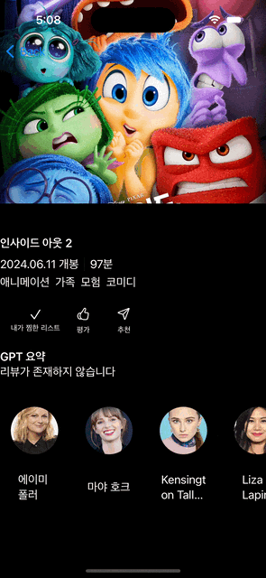
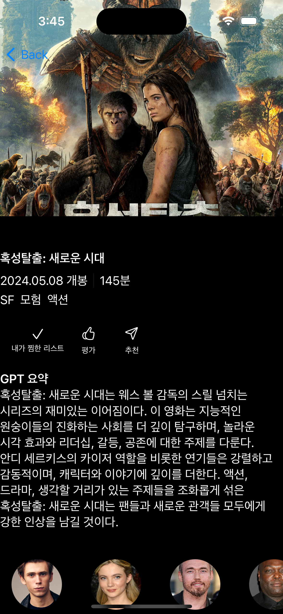

# SmartMovie 

## 어떤 앱인가?
#### TMDB API로부터 영화에 대한 정보를 가져오고 영화 리뷰를 GPT를 사용하여 분석 요약하여 사용자한테 보여주는 서비스 앱입니다.
이 앱은 TMDB API와 Chat GPT API를 사용합니다

## TMDB API 사용하기 
https://developer.themoviedb.org/reference/intro/getting-started 

## GPT API Key 발급받기
다음 GPT 요약 서비스를 이용하기 위해서는 링크를 통해 API Key를 발급받아줍니다. https://platform.openai.com/account/api-keys

## 사용한 GPT 패키지
https://github.com/MacPaw/OpenAI 을 가지고 SPM을 추가해줍니다.
```
https://github.com/MacPaw/OpenAI
```

## 늘어나는 뷰
늘어나는 뷰를 만들기 위해서 ViewModifier를 사용하였습니다.

<div align="center">
  
</div>

```swift
struct StetchyHeaderViewModifier: ViewModifier {
    
    var startingHeight: CGFloat = 300
    var coordinateSpace: CoordinateSpace = .global
    
    func body(content: Content) -> some View {
        GeometryReader(content: { geometry in
            content
                .frame(width: geometry.size.width, height: stretchedHeight(geometry))
                .clipped()
                .offset(y: strechedOffset(geometry))
        })
        .frame(height: startingHeight)
    }
    
    private func yOffset(_ geo: GeometryProxy) -> CGFloat {
        geo.frame(in: coordinateSpace).minY
    }
    
    private func stretchedHeight(_ geo: GeometryProxy) -> CGFloat {
        let offset = yOffset(geo)
        return offset > 0 ? (startingHeight + offset) : startingHeight
    }
    
    private func strechedOffset(_ geo: GeometryProxy) -> CGFloat {
        let offset = yOffset(geo)
        return offset > 0 ? -offset : 0
    }
}
```

## 좋아요한 노래
좋아요를 누른 영화들을 따로 저장하여 확인할 수 있도록 만들었습니다.

<div align="center">
  
</div>

### 좋아요한 영화를 저장하기 위한 @Model
```swift
@Model
class FavoriteMovie: Identifiable {
    var id: Int
    var posterURL: String
    var title: String
    var releaseDate: Date
    
    init(id: Int, posterURL: String, title: String, releaseDate: Date) {
        self.id = id
        self.posterURL = posterURL
        self.title = title
        self.releaseDate = releaseDate
    }
}
```

## GPT로 영화 리뷰 요약하기
영화리뷰를 GPT API를 사용하여 분석을 합니다.

<div align="center">
  
</div>

### 영화 리뷰 가져오기
영화리뷰를 분석하기 위해서 TMDB API를 통해서 리뷰 데이터들을 가져와 해당 리뷰들을 합쳐 GPT에 데이터 **분석**을 요청합니다.

```swift
func fetchMovieReview() {
    guard let movieId = movie?.id else { return }
    let reviewEndPoint = MovieReviewEndPoint(movieId: movieId)
    Task {
        do {
            let decodedData = try await networkManager.fetchData(to: MovieReviewDTO.self, endPoint: reviewEndPoint)
            guard let reviews = decodedData as? MovieReviewDTO else { processing = false; return }
            var tempReview: [Review] = []
            for review in reviews.results {
                tempReview.append(review)
            }
            self.reviews = tempReview
            await analizeReview(reviews: self.reviews.map({ review in 
                return review.content
            }).joined())
        }
        catch {
            processing = false
            debugPrint(error.localizedDescription)
        }
    }
}
```

### 영화 리뷰 GPT로 분석
위에서 가져온 데이터를 GPT를 통해서 분석합니다, 앞에 리뷰를 먼저 붙이고 이후 명령어를 붙여 분석을 요청합니다.

```swift
    @MainActor
    func analizeReview(reviews: String) async {
        do {
            let query1 = CompletionsQuery(model: "gpt-3.5-turbo-instruct", prompt: reviews + "\(String(describing: movie?.title)) 영화 리뷰를 간단하게 한국어로 요약해줘. 요약한 말만 대답해줘.", temperature: 0, maxTokens: 1000, topP: 1, frequencyPenalty: 0, presencePenalty: 0)
            let result1 = try await openAI.completions(query: query1)
            result1.choices.forEach { choice in
                self.summery += choice.text.replacingOccurrences(of: "\"", with: "").replacingOccurrences(of: "\n\n", with: "")
                print("긍정:\(self.summery)")
            }
            processing = false
        } catch {
            print(error.localizedDescription)
        }
        
    }
```


